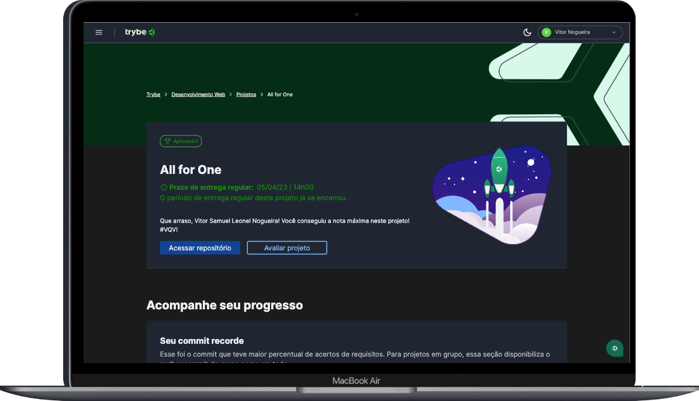

## All for One



---
<details>
<summary><span style="font-size: 1.5rem;"> 👨🏼‍💻 Proposta</span></summary>
  - Desafios de SELECT e criação de dados; </br>
  - Desafios sobre filtragem de dados; </br>
  - Desafios de manipulação de tabelas.
</details>

---
<details>
<summary><span style="font-size: 1.5rem;"> 📝 Funcionalidades</span></summary>
  - Manipulação banco de dados MySQL - Nortwind </br>
  - Pesquisas, filtros e alterações no banco de dados
</details>

---
<details>
<summary><span style="font-size: 1.5rem;"> 💡 Tecnologias Utilizadas</span></summary>
  - MySQL </br>
  - Docker 
</details>

----
### Como executar o projeto
> ⚠️ É necessário ter o Docker e MySQL para executar o projeto
1. Clone este repositório
````
git clone git@github.com:vitor-nogueira-dev/all-for-one.git
````
2. Na pasta raiz do projeto, execute o seguinte comando para instalar as dependências:
```
npm install
``` 
3. Ainda na pasta raiz do projeto suba o container: 
````
docker-compose up -d
````
4. Crie o banco de dados com os comandos do arquivo `nortwind.sql`
5. Depois que o banco estiver criado você pode copiar as querys dos arquivos `desafio01...27` e testar no seu ambiente MySQL

### Contribuições
> 💡Contribuições são bem-vindas! Se você tiver alguma sugestão ou encontrar um bug, por favor, abra uma issue ou envie um pull request.


